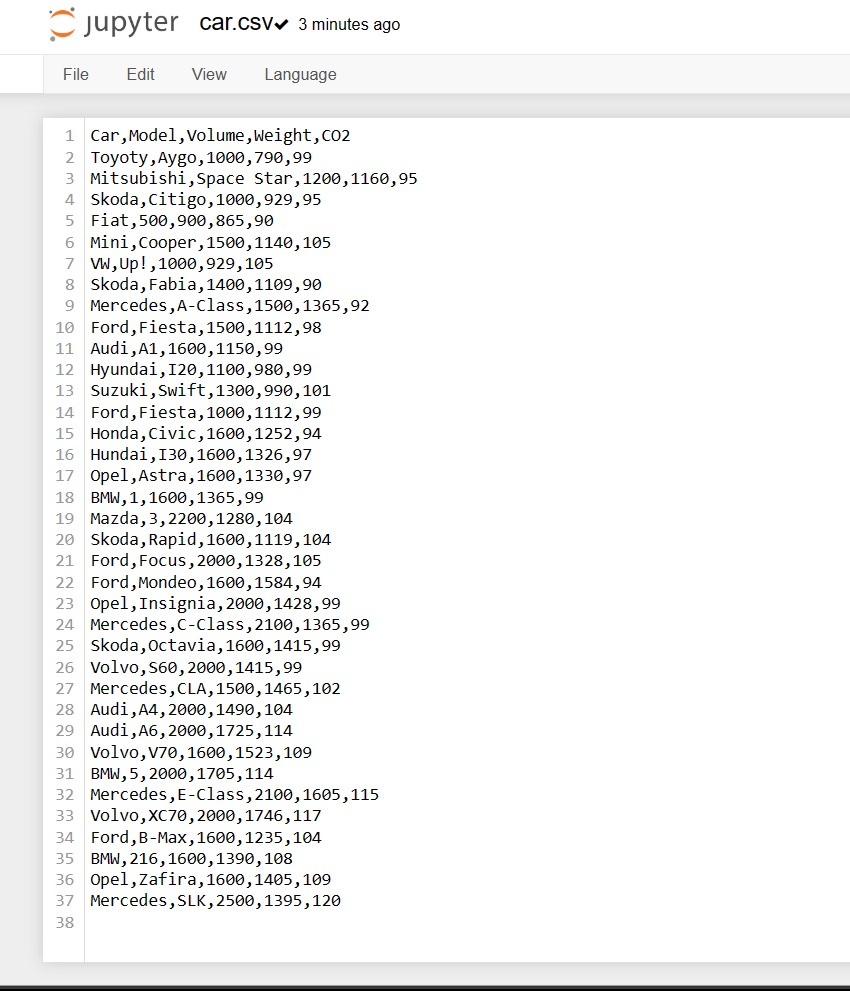

# Read-from-CSV

## AIM:

## ALGORITHM:
### Step 1: 
Create a spreadsheet with any details in it with the extension .csv .

### Step 2: 
Open Google Colab and mount the drive for using the created file in the Colab.

### Step 3: 
Import pandas package as pd for reading the csv file using pd.read_csv(filename).

## Step 4: 
Use the functions called head() and tail() for printing the top and bottom of the file and then axes[ ] used for finding the number of rows and columns.

### Step 5: 
End the Program.

## PROGRAM:
```
#To write a python program to read a csv file.
#Developed By: Muhammad Afshan A
#Register Number: 212223100035
import pandas as pd
df=pd.read_csv('cars.csv')
print(df.head(3))
print(df.tail(7))
print(df.axes[0],len(df.axes[0]))
print(df.axes[1],len(df.axes[1]))
print(df.loc[2:6,:])
```
## OUTPUT:
### CODE AND OUTPUT:

### CARS.CSV:

### EXCEL:

## RESULT:
Thus the program is written to read the csv file using the package pandas.